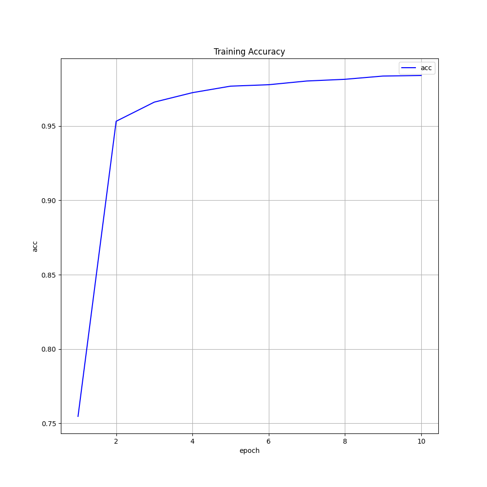
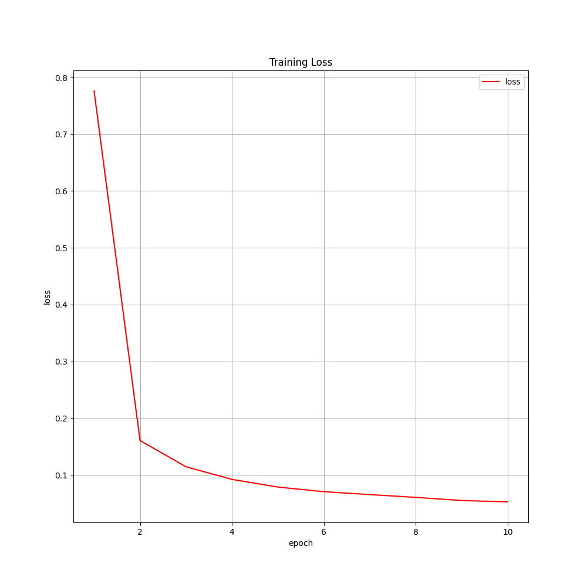
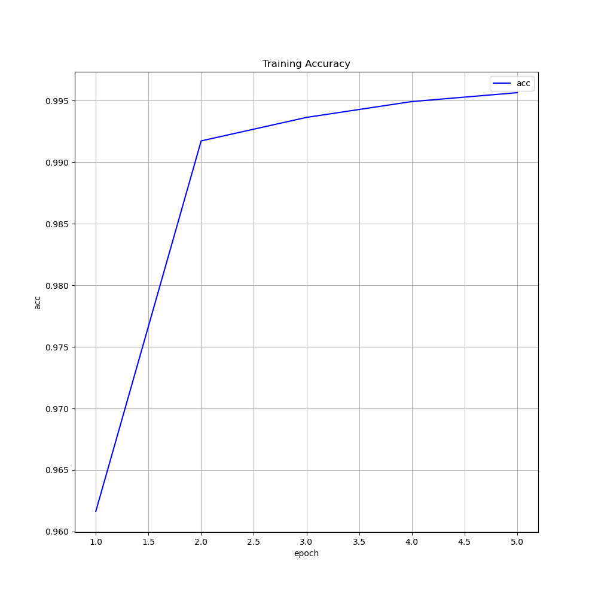
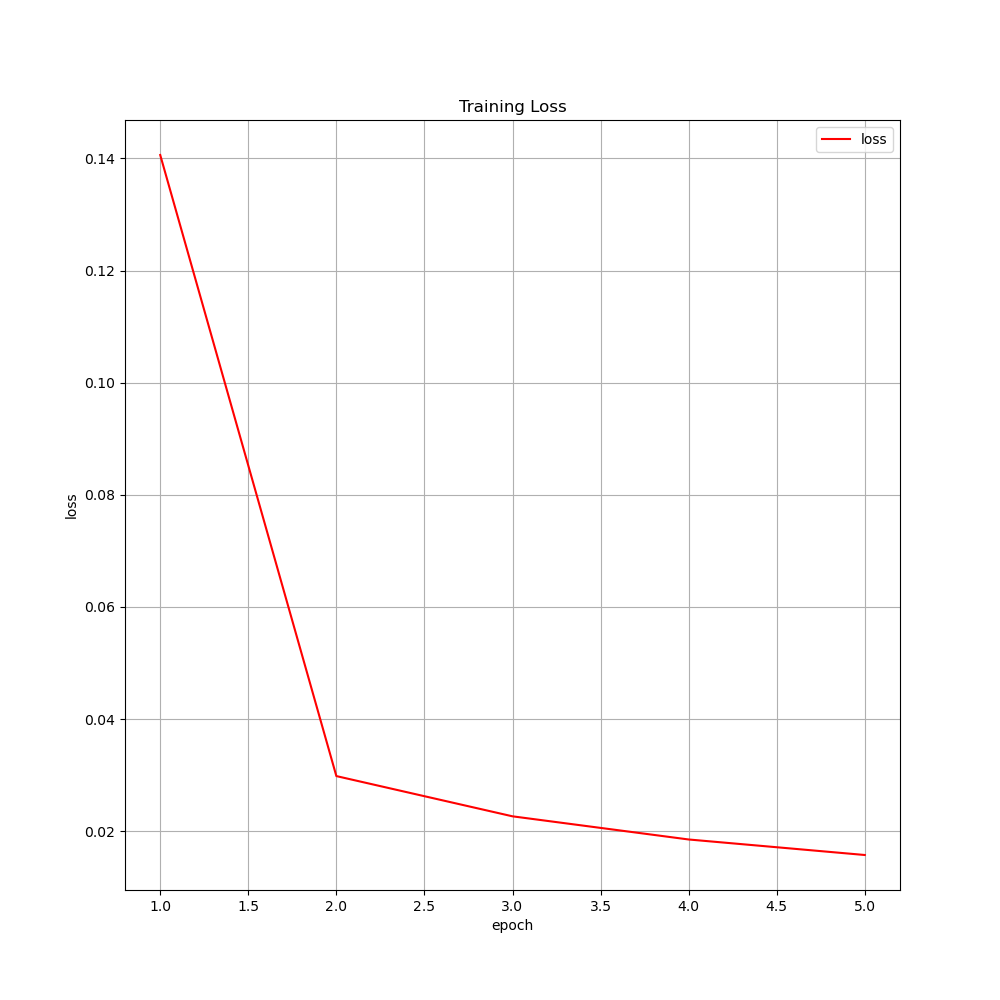
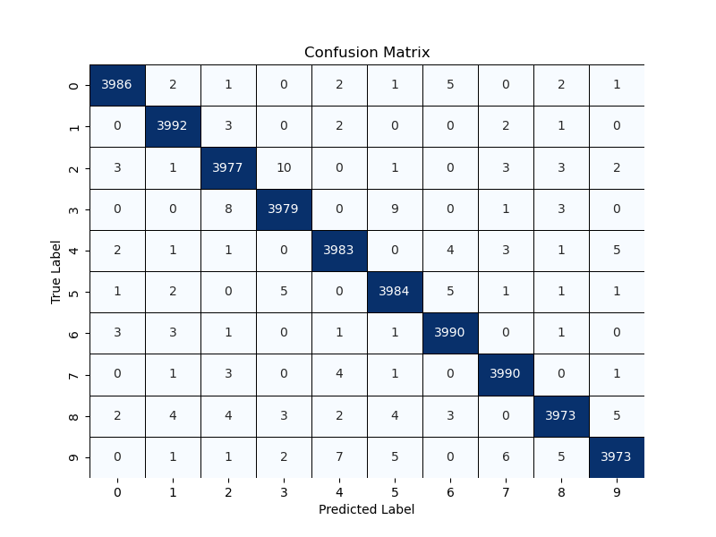
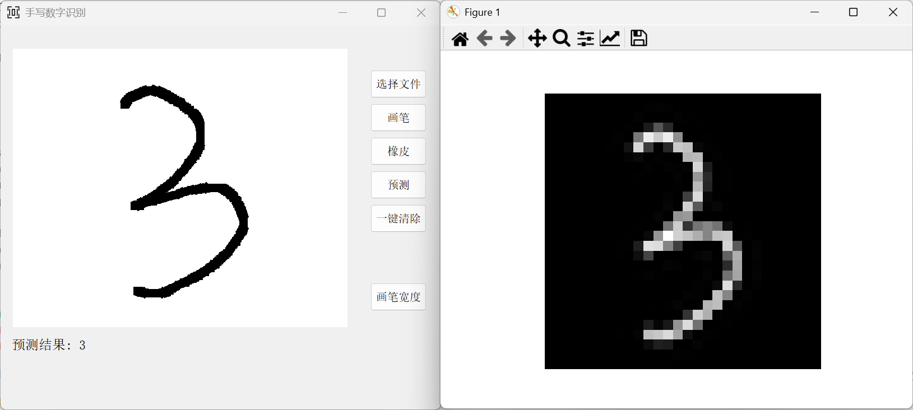

# CNN Handwritten Digit Recognition

[](LICENSE)  
[](https://pytorch.org/)  
[](https://riverbankcomputing.com/software/pyqt/)

> 一个基于 PyTorch 的卷积神经网络 (CNN)，利用 MNIST 与 EMNIST 数据集训练，并配合 PyQt5 实现手写数字识别小系统界面。

---

## 🗂 项目结构

```bash
CNNNumberRecognition/
├── data/                 # 下载后存放数据集（MNIST & EMNIST）
├── img/                  # 训练结果与演示截图
│   ├── mnist_accuracy.png
│   ├── mnist_loss.png
│   ├── mnist_confusion_matrix.png
│   ├── mnist_demo.png
│   ├── emnist_accuracy.png
│   ├── emnist_loss.png
│   ├── emnist_confusion_matrix.png
│   ├── emnist_demo.png
│   └── number.png        # GUI 图标
├── src/                  # 源代码目录
│   ├── analyzer.py       # 输入手写图像预处理与特征分析
│   ├── data_loader.py    # 数据集下载与预处理
│   ├── gui.py            # PyQt5 界面实现
│   ├── main.py           # 训练/测试入口脚本
│   ├── model.py          # CNN 网络结构定义
│   ├── trainer.py        # 训练与评估逻辑
│   └── utils.py          # 工具函数与配置
├── LICENSE
└── README.md
````

---

## 🚀 环境依赖

主要包含：
* Python 3.7+
* PyTorch 1.7+
* torchvision
* PyQt5
* numpy
* matplotlib

```bash
pip install torch torchvision pyqt5 numpy matplotlib
```

---

## 📥 1. 数据集下载

在运行训练或测试前，需先下载数据集：

```bash
cd CNNNumberRecognition/src
python data_loader.py
```

* MNIST 与 EMNIST 数据集将自动下载并保存在 `project/data/` 下。

---

## 🏋️ 2. 模型训练与测试

使用 `main.py` 进行模型训练与测试：

```bash
cd CNNNumberRecognition/src
python main.py --data mnist
# 或使用 EMNIST：
python main.py --data emnist
```

* 参数说明：
  
  * `--data`: `mnist` 或 `emnist`

* 训练和测试完毕后，模型权重保存在 `project/models/`。


## 🖼 3. 运行 GUI 界面

启动 PyQt5 手写识别界面：

```bash
cd CNNNumberRecognition/src
python gui.py --dataset mnist
```

* 可在参数中指定 `mnist` 或 `emnist`，加载对应训练权重。
* 在 GUI 中手写数字后，点击识别，展示预测结果（如下图所示）。

---

## 📊 实验结果示例

### MNIST 训练曲线 & 混淆矩阵

  


### EMNIST 训练曲线 & 混淆矩阵

  


### GUI 演示


